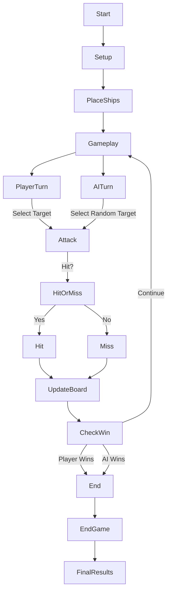

```mermaid
graph TD;
    Start-->Setup;
    Setup-->PlaceShips;
    PlaceShips-->Gameplay;
    Gameplay-->PlayerTurn;
    Gameplay-->AITurn;
    PlayerTurn-->|"Select Target"|Attack;
    AITurn-->|"Select Random Target"|Attack;
    Attack-->|"Hit?"|HitOrMiss;
    HitOrMiss-->|"Yes"|Hit;
    HitOrMiss-->|"No"|Miss;
    Hit-->UpdateBoard;
    Miss-->UpdateBoard;
    UpdateBoard-->CheckWin;
    CheckWin-->|"Player Wins"|End;
    CheckWin-->|"AI Wins"|End;
    CheckWin-->|"Continue"|Gameplay;
    End-->EndGame;
    EndGame-->FinalResults;
```