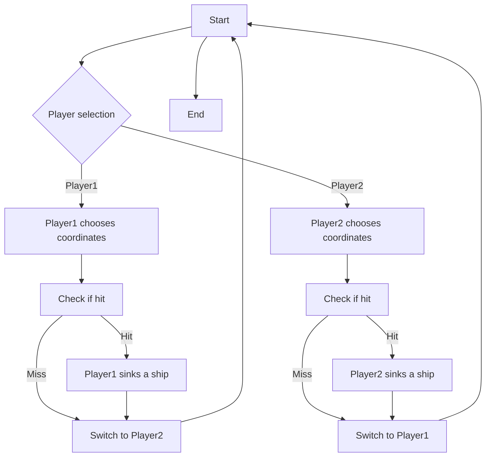

# Battleship Game Flowchart

```mermaid
flowchart TD
    A[Start] --> B{Player selection}
    B -- Player1 --> C[Player1 chooses coordinates]
    C --> D[Check if hit]
    D -- Hit --> E[Player1 sinks a ship]
    D -- Miss --> F[Switch to Player2]
    B -- Player2 --> G[Player2 chooses coordinates]
    G --> H[Check if hit]
    H -- Hit --> I[Player2 sinks a ship]
    H -- Miss --> J[Switch to Player1]
    E --> F
    I --> J
    F --> A
    J --> A
    A --> K[End] 
```

This flowchart encompasses all the flows of the Battleship game, illustrating how players can switch turns and how hits and misses are handled. 
